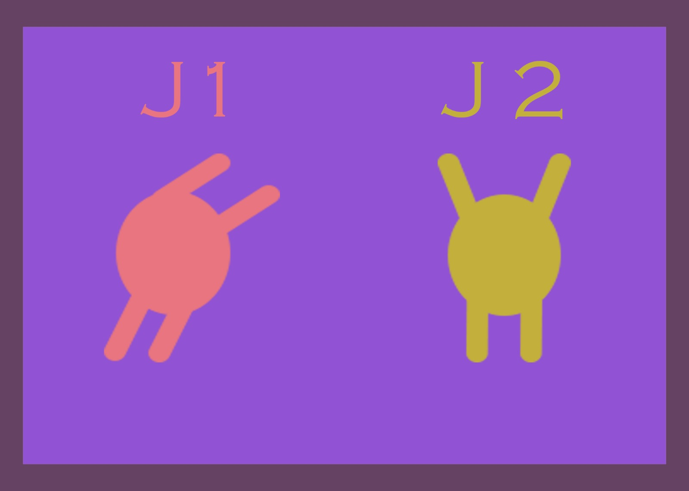

# SeeYouAtTheSummit

Un juego de Red Wire Wire, desarrollado por Mario Rabanaque Buil, Andrés Tena De Tena y Aitor Iribar Etxezarreta

# Segunda versión de GDD

# Concepto
SeeYouAtTheSummit (o SYATS para abreviar) es un juego diseñado para PC en el que dos jugadores se embarcan en un desafío por descubrir cuál de los dos quedará en pie el último en su periplo de llegar hasta la cima de la montaña interminable. Para ello deberán colocar plataformas a lo largo del camino sobre las que saltar y escalar con el objetivo de no quedarse atrás. Sin embargo, la estrategia juega un importante factor ya que estas plataformas desaparecen bajo ciertas circunstancias, provocando caídas indeseadas y cambios en las estructuras.\
SYATS es un juego que mezcla las mecánicas de movimiento del género de plataformas con la capacidad de construir estructuras con piezas aleatorias que caen del cielo al más puro estilo Tetris. El juego está destinado a todos los públicos, pero sobre todo aquellos que sientan nostalgia por el clásico Tetris encontrarán en SYATS la esencia que les hizo amarlo.\
Para su desarrollo, se empleará el lenguaje de programación JavaScript en el entorno de desarrollo de Phaser. En cuanto a la edición de sonido/música e imágenes, se utilizarán los programas Reaper y Photoshop respectivamente.

# Mecánicas de juego
Crear plataformas:\
El campo de juego está dividido con una cuadrícula. Desde la parte superior de la pantalla, caen dos plataformas (una por jugador) inspiradas por el juego clásico "Tetris". Su comportamiento general en cuanto a forma y reglas de movimiento es parecido a este juego. Dependiendo del jugador que controles, saldrá en la mitad derecha o izquierda.\
Estas plataformas respetan la cuadrícula. Cada jugador tiene control sobre una de las plataformas que caen. Pueden mover, rotar y acelerar la caída de la misma con las teclas direccionales. También pueden congelar la plataforma en su posición actual con la tecla ENTER, siempre y cuando no esté compartiendo espacio con otra plataforma, un jugador, el suelo u otra entidad.\
Una vez congelada, la plataforma dejará de moverse permanentemente, y sus colisiones serán activadas. Otra plataforma empezará a caer desde su correspondiente lado de la pantalla, al control de este mismo jugador. La selección de la siguiente forma de plataforma es pseudo-aleatoria según un algoritmo procedural. Se estudiará en un prototipo la posibilidad de mostrar el siguiente par de formas que caerán al jugador (en vez de no mostrar esta información de ninguna manera).

Destruir plataformas:\
Las plataformas están compuestas por unos cuadrados. Cuando se encuentren cinco cuadrados congelados en secuencia horizontal o vertical, dichos cuadrados desaparecerán dejando caer a los jugadores que se encuentren sobre ellos. El juego no discrimina en cuanto al jugador que ha colocado estos cuadrados, los trata a todos por igual.\

Controles:\
SYATS dispone de diferentes modos de juego, y dependiendo de en cual nos encontremos los controles varían. El factor principal que determina estos controles es el número de jugadores jugando desde el mismo ordenador y con el mismo teclado. El modo multijugador local permitirá a dos jugadores compartir teclado, mientras que en el resto de casos cada jugador implicado jugará con el teclado entero para él. 
En los casos de un jugador con un teclado (el más común) este controla el movimiento de su personaje usando las teclas "A" y "D" y salta usando la barra espaciadora. Su movimiento estará regido en parte por la inercia, teniendo cierta aceleración y deceleración. Se mueven en un espacio continuo, no el espacio discreto usado por la creación de plataformas. Usando las flechas de dirección puede mover y rotar las piezas de tetris que van cayendo y con el botón shift fijarlas en el espacio. Por último, el botón enter se utilizará para posar durante el gameplay (mofándose así de su rival) y para realizar una reverencia al comienzo de la partida.\
El arco del salto dependerá del tiempo que el jugador mantenga pulsada la tecla W. Una vez se haya comenzado el salto con una fuerza inicial, se seguirá añadiendo cierta cantidad de fuerza (hasta un límite de tiempo) para que el jugador tenga un grado de control sobre la altura y duración del salto. Habrá una fuerza de gravedad constante.\
Los jugadores colisionarán con las plataformas en todas direcciones (no podrán atravesarlas desde abajo). No colisionarán entre ellos y no tendrán ninguna manera directa de influenciar al otro jugador.

Cámara:\
La cámara de juego ascenderá a una velocidad constante. Además, tendrá una determinada altura en espacio de pantalla definida. Si un jugador se coloca por encima de esta altura, la cámara ascenderá a una velocidad mayor hasta alcanzar a dicho jugador y haberle colocado por debajo de dicha altura. Una vez haya alcanzado al jugador, volverá a ascender con la velocidad original.\
La superficie del juego que la cámara cubre será siempre constante, es decir, nunca cambiará nivel de zoom.

Condición de fracaso:\
Un jugador pierde la partida en el momento en el que la cámara le deja atrás. En términos técnicos, esto siginifica que el sprite del jugador en su totalidad se ha quedado fuera del frustrum por debajo del mismo.
Cuando esto ocurra, la partida terminará y se reproducirá una pequeña animación final.

Condición de victoria:\
El juego no tiene un objetivo explícito para alcanzar la victoria. Un jugador gana cuando su oponente pierde. Para esto tendrá que dejarle atrás, tanto con un movimiento más veloz y preciso como con la creación y destrucción estratégica de plataformas.

# Estados del juego
El primer estado al que accedemos es la portada del juego, en el que observamos un plano general del espacio donde se desarrolla este. Tras unos segundos se muestra el mensaje de "Press enter". Al pulsar la tecla enter se mostrarán las opciones del Menú Principal, entre las cuales tenemos "Multiplayer", "Single player" y "Training". Aquí debemos seleccionar un modo de juego.\
Si seleccionamos Multiplayer nos volverán a aparecer dos opciones: "Online" y "Local". La opción Online nos lleva a una pantalla de carga que sirve de matchmaking. Una vez encuentre a un rival, se llevará a ambos jugadores al estado de gameplay online. La opción local, por otro lado, permite a dos jugadores jugar en el mismo teclado y les lleva directamente al estado de gameplay local.\
La opción del menú principal de Single player lleva al jugador al estado de gameplay individual, donde todas las normas son las mismas salvo que solo hay un jugador en partida.\
Por último, la opción training permite al jugador entrar al estado de gameplay de entrenamiento. Aquí el fondo del escenario muestra los controles y la cámara no se mueve, dando al jugador libertad para probar controles y entrenar.\
Al morir en cada estado de gameplay, si el jugador pulsa enter, se le devuelve a la pantalla principal del juego.

# Personajes
Los personajes que los jugadores controlen serán siempre los mismos (el del Jugador 1 será siempre igual y lo mismo con el Jugador 2). Su diseño será simple y fácilmente diferenciable entre ellos mismos. Basados en figuras "stickman" básicas y de un solo color cada uno.

# Música
El juego tendrá dos pistas de música diferentes.\
Menú principal: Una pista tranquila, de instrumentación escasa. Poco más que un instrumento melódico con ataque pronunciado y no demasiado sustain. Esto se combinará con el soundscape relajado de la montaña.\
Gameplay: Durante la animación de inicio de la partida, no habrá música. En el momento en el que comienza la partida, comenzará una pista extremadamente contrastante con la música del menú. Se tratará de una pista intrumental divertida, con mucha sincopación, y un elevado número de instrumentos que se irán turnando para hacer de voz principal. El género al que más se acerca es el funk.

# Sonido
En el menú principal y durante la secuencia de inicio de la partida, se creará un soundscape poco cargado. Estará dominado por el sonido del viento, con puntuales sonidos de aves en la distancia. Este soundscape desaparecerá una vez comience el gameplay, siendo sustituido por la música.\
Cada acción de los jugadores tendrá sonidos cortos y satisfactorios asociados. Saltar, aterrizar, caminar, mover plataformas, colocarlas, y destruirlas.

# Interfaz

La única interfaz actual en el juego es la del Menú Principal y la existente al final de cada partida. En el menú la interfaz está presente con las diferentes opciones de elección de modo de juego, siendo cada una de ellas el texto que informa de su función (no son botones sino palabras no contenidas en cajas). Por otra parte al acabar cada partida un texto aparece en medio de la pantalla anunciando al ganador de esta (se está estudiando retocar estéticamente estos textos). Por último podríamos considerar la pantalla de carga previa a las partidas multijugador. Esta pantalla muestra una ilustración y un icono rotando, con el cual el jugador puede intuir que se está buscando a un oponente/se está cargando su partida. Se estudia la posibilidad de implementar más interfaz al juego.

